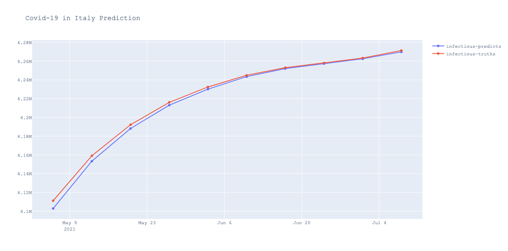
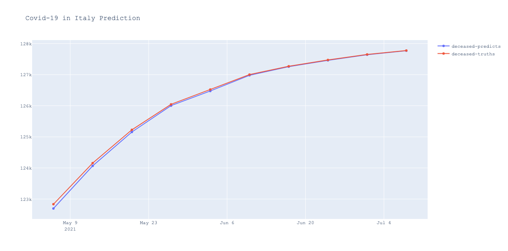
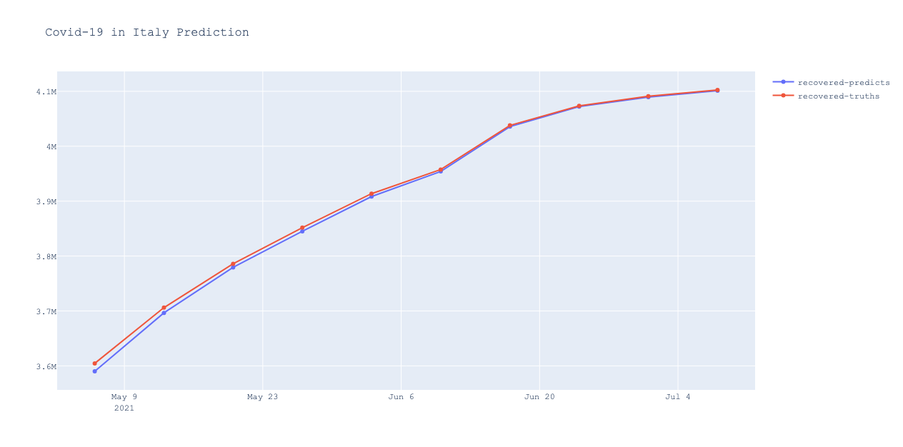

The COVID-19 forecasting model used here is similar to the one studied the paper [https://www.nature.com/articles/s41598-022-11693-9]. To run the forecasting please follow the steps below.

1. Install Anaconda environment using yalm file:
   ```
   conda update conda
   cd covid-19-forecasting
   conda env create -f environment.yml
   ```
3. Run ```main.py``` with flag ```--train``` if the model needs to be re-trained. Otherwise, just simply run:
   ```
   python main.py
   ```
3. Example of COVID-19 forecasting in Italy:
   
5. Modify the configuration file "configs/config.yaml" if you want to forecast the COVID-19 disease for other countries or for training settings.
